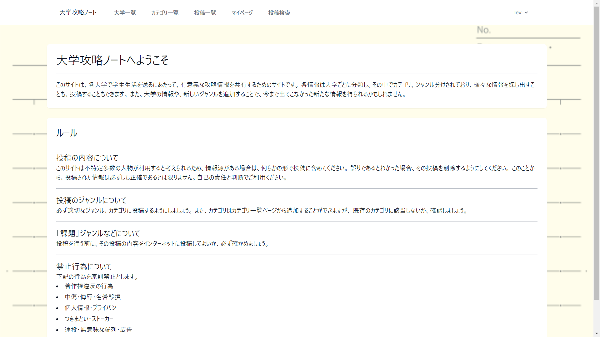
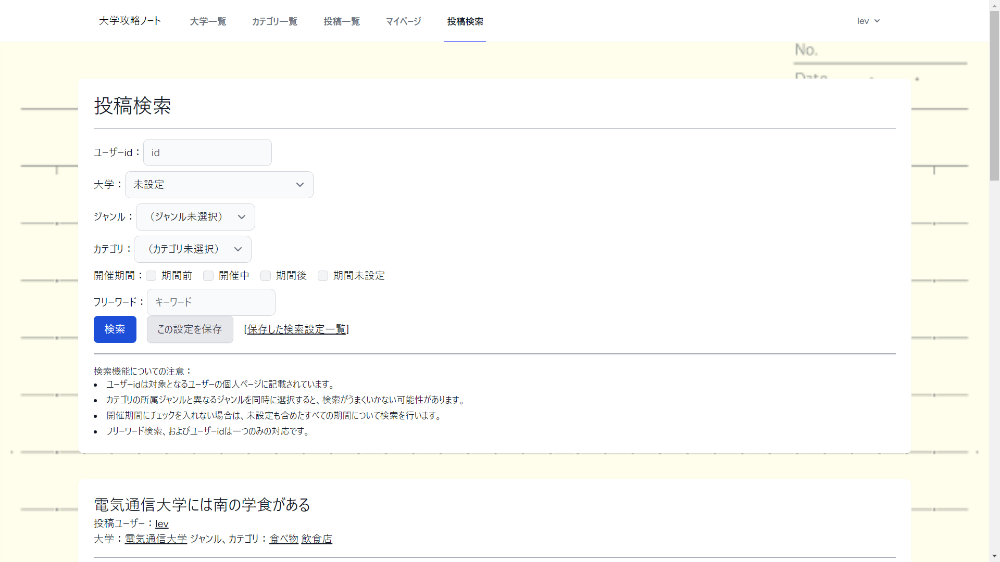

# University Walkthrough Notes
This application is a message board dedicated to information related to universities.
You can enhance your university life by getting information from other people's postings.

For this idea, with the seniors in the circle, who wrote down useful information in university, and,
I was inspired by the communication notebooks that existed in game arcades, notebooks that provided game strategy information.

You can search by detailed conditions such as university, category, and period of the event.
Also, if the university you are belonging to or the genre of information you are seeking does not exist, you can register a new one.
With this, you can find information not only about universities, but also about events that may be held near your university.

## DEMO

## Features
-Login Functions
-New user registration function (username, password)
-Registration function for additional user information (university, classification, affiliation, self-introduction)
-Registration function for genres and universities
-Posting function (image attaching function, period setting function)
-Editing function of postings
-Search by multiple conditions such as genre, category, and author

## Requirement
*cloud9
*Laravel Framework 9.52.15
*PHP 8.0.30
*MariaDB 10.2.38

## Usage
It has been deployed to and is available on heroku.

You can also download and use them.
After installing the above required packages, please run 'php artisan serve' command.

The test user and password are as follows.
email:test@gmail.com
password:test

## Note
-Users can add information about category and university,but cannot be removed by the user.

-Only one image can be attached to a post.

## ER diagram

## Future updates planned:
-Update layout for smart phones
-Add follow function
-Processing of deleted user posts
-~~Function to delete a post after a selected date and time~~abandoned due to Heroku's fee system

## Author
Daigo Kuroki

## License
"University Walkthrough Notes" is under [MIT license](https://en.wikipedia.org/wiki/MIT_License).