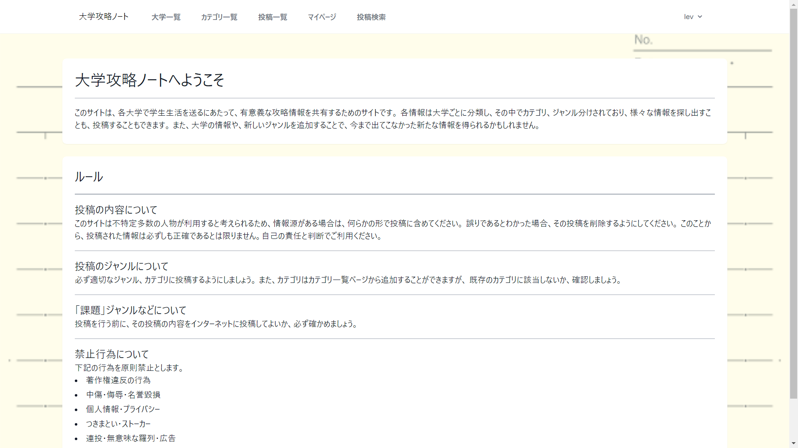
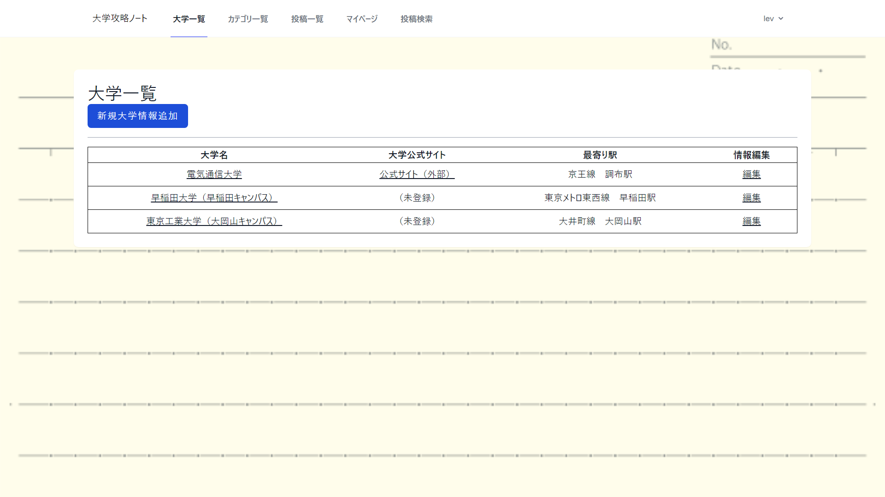
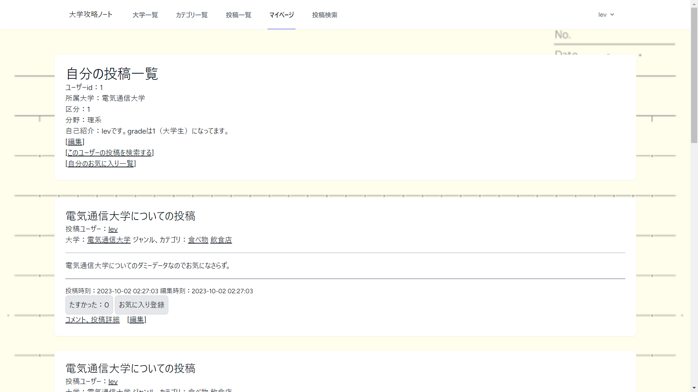
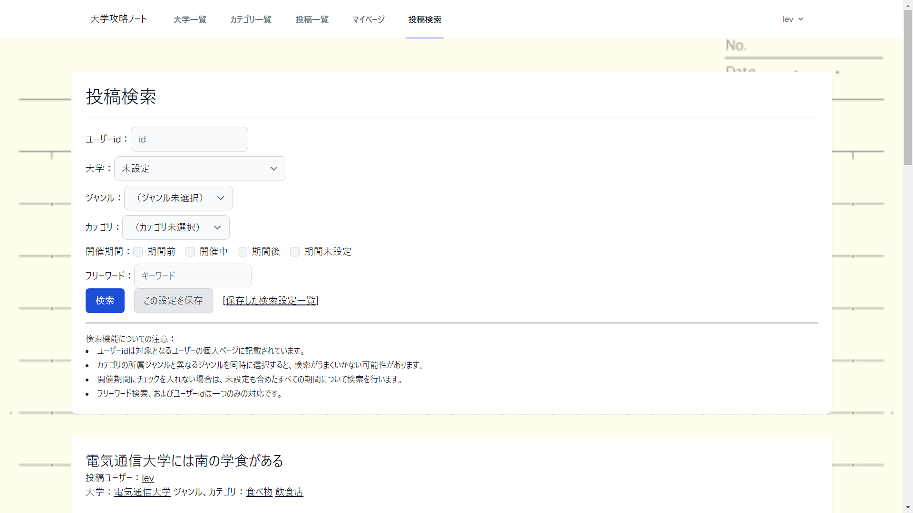

# 大学攻略ノート
このアプリは、大学に関する情報に特化した掲示板です。
他の人の投稿から情報を得ることで、大学生活をより充実させることができます。

このアイデアは、大学生活で役立つ情報を書き残していたサークルの先輩方と、
ゲームセンターにあった、ゲームの攻略情報を共有するノートであるコミュニケーションノートから着想を得ました。

大学、カテゴリ、イベントの開催期間など細かい条件から検索が可能です。
また、所属している大学や求めている情報のジャンルが存在しない場合は、新たに登録することもでき、
これにより、大学に関する情報だけでなく、自分の大学の近くで開催されているイベントの情報も探すことができます。

## デモ

## 機能
-ログイン機能
-ユーザー新規登録機能（ユーザーネーム、パスワード）
-ユーザーの追加情報登録機能（所属大学、区分、所属、自己紹介）
-ジャンル、大学の登録機能
-投稿機能（画像添付機能、開催期間の設定機能）
-投稿の編集機能
-ジャンル、カテゴリ、投稿者などの複数の条件での検索

## 使用パッケージ
*cloud9
*Laravel Framework 9.52.15
*PHP 8.0.30
*MariaDB 10.2.38

## 使用方法
Herokuにデプロイされているので、そちらをご利用ください。

テスト用のアカウントのメールアドレスとパスワードは以下になります。
email:test@gmail.com
password:test

## 注意
*ユーザーはカテゴリと大学を新規追加できますが、削除することはできません。
*投稿に対して画像は一つしか添付できません。

## ER図

## 実装予定
-スマートフォン用レイアウト
-フォロー機能
-ユーザーが削除された場合の投稿の扱い方について
-~~指定した日時で投稿が削除される機能~~(Herokuの料金システムの都合で断念)

## 製作者
黒木大悟

## ライセンス
このアプリケーションは [MIT license](https://en.wikipedia.org/wiki/MIT_License) に従います。